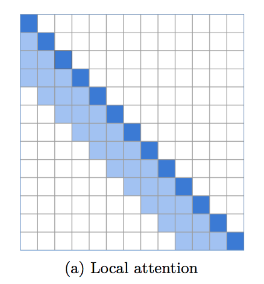

</img>

## Local attention

An implementation of local windowed attention, which sets an incredibly strong baseline for language modeling. It is becoming apparent that a transformer needs local attention in the bottom layers, with the top layers reserved for global attention to integrate the findings of previous layers. This repository makes it easy to immediately employ local window attention.

This code has been battletested in multiple repositories already, alongside different implementations of sparse long-range attention.

## Install

```bash
$ pip install local-attention
```

## Usage

```python
import torch
from local_attention import LocalAttention

q = torch.randn(2, 8, 2048, 64)
k = torch.randn(2, 8, 2048, 64)
v = torch.randn(2, 8, 2048, 64)

attn = LocalAttention(
    dim = 64,                # dimension of each head (you need to pass this in for relative positional encoding)
    window_size = 512,       # window size. 512 is optimal, but 256 or 128 yields good enough results
    causal = True,           # auto-regressive or not
    look_backward = 1,       # each window looks at the window before
    look_forward = 0,        # for non-auto-regressive case, will default to 1, so each window looks at the window before and after it
    dropout = 0.1,           # post-attention dropout
    exact_windowsize = False # if this is set to true, in the causal setting, each query will see at maximum the number of keys equal to the window size
)

mask = torch.ones(2, 2048).bool()
out = attn(q, k, v, mask = mask) # (2, 8, 2048, 64)
```

This library also allows for local attention in the setting of shared query/key space (Reformer architecture). The normalization of the keys, as well as the masking of tokens to itself, will be taken care of.

```python
import torch
from local_attention import LocalAttention

qk = torch.randn(2, 8, 2048, 64)
v  = torch.randn(2, 8, 2048, 64)

attn = LocalAttention(
    dim = 64,
    window_size = 512,
    shared_qk = True,
    causal = True
)

mask = torch.ones(2, 2048).bool()
out = attn(qk, qk, v, mask = mask) # (2, 8, 2048, 64)
```

If you wish for the module to automagically pad your query / key / values as well as the mask, simply set the `autopad` keyword to `True`

```python
import torch
from local_attention import LocalAttention

q = torch.randn(8, 2057, 64)
k = torch.randn(8, 2057, 64)
v = torch.randn(8, 2057, 64)

attn = LocalAttention(
    window_size = 512,
    causal = True,
    autopad = True      # auto pads both inputs and mask, then truncates output appropriately
)

mask = torch.ones(1, 2057).bool()
out = attn(q, k, v, mask = mask) # (8, 2057, 64)
```

### Local Attention Transformer

A full local attention transformer

```python
import torch
from local_attention import LocalTransformer

model = LocalTransformer(
    num_tokens = 256,
    dim = 512,
    depth = 6,
    max_seq_len = 8192,
    causal = True,
    local_attn_window_size = 256
).cuda()

x = torch.randint(0, 256, (1, 8192)).cuda()

logits = model(x) # (1, 8192, 256)
```

### Enwik8 at 4096

window size of 256, lookback of 1, total receptive field of 512

```bash
$ python train.py
```

## Citation

```bibtex
@inproceedings{rae-razavi-2020-transformers,
    title   = "Do Transformers Need Deep Long-Range Memory?",
    author  = "Rae, Jack  and Razavi, Ali",
    booktitle = "Proceedings of the 58th Annual Meeting of the Association for Computational Linguistics",
    month   = jul,
    year    = "2020",
    address = "Online",
    publisher = "Association for Computational Linguistics",
    url     = "https://www.aclweb.org/anthology/2020.acl-main.672"
}
```

```bibtex
@misc{roy*2020efficient,
    title   = {Efficient Content-Based Sparse Attention with Routing Transformers},
    author  = {Aurko Roy* and Mohammad Taghi Saffar* and David Grangier and Ashish Vaswani},
    year    = {2020},
    url     = {https://arxiv.org/pdf/2003.05997.pdf}
}
```

```bibtex
@misc{beltagy2020longformer,
    title   = {Longformer: The Long-Document Transformer},
    author  = {Iz Beltagy and Matthew E. Peters and Arman Cohan},
    year    = {2020},
    eprint  = {2004.05150},
    archivePrefix = {arXiv},
    primaryClass = {cs.CL}
}
```

```bibtex
@inproceedings{Sun2022ALT,
    title     = {A Length-Extrapolatable Transformer},
    author    = {Yutao Sun and Li Dong and Barun Patra and Shuming Ma and Shaohan Huang and Alon Benhaim and Vishrav Chaudhary and Xia Song and Furu Wei},
    year      = {2022}
}
```
